# Haptic Content Reader

A sophisticated iOS application that analyzes PDF documents for emotional content using GPT-4 and GPT-4 Vision, then generates customizable haptic feedback patterns for an enhanced reading experience.

## 🎯 Project Overview

Haptic Content Reader transforms traditional PDF reading into an immersive, emotionally-aware experience by:
- **Analyzing PDF content** for emotional patterns using AI
- **Generating haptic feedback** that matches the emotional tone
- **Providing real-time interaction** through Apple Pencil and haptic feedback
- **Supporting multiple content types** (text, images, GIFs)

### Key Features
- **Multi-granularity Analysis**: Word, sentence, and paragraph-level emotion detection
- **Intelligent Pattern Matching**: GPT embedding-based haptic pattern selection
- **Real-time Feedback**: Instant haptic response to Apple Pencil touch
- **Device Integration**: Bluetooth connection to MagicPen haptic device
- **Accurate Positioning**: Native PDFKit-based content extraction and positioning

## 🚀 Quick Start

### Prerequisites
- iOS 15.0 or later
- Xcode 14.0 or later
- OpenAI API key
- MagicPen device (optional)

### Setup
1. Clone the repository
2. Add your OpenAI API key to `APIKey.swift`
3. Build and run the project
4. Import a PDF document
5. Select analysis mode and granularity
6. Touch highlighted regions to experience haptic feedback

## 🏗️ System Architecture

### Complete System Pipeline

```mermaid
graph TB
    %% Vector Initialization
    A0[📚 Initialize Tactile Vector Cache<br><small>HapticLibrary.swift:639-679</small>] --> A[📄 PDF Document]
    
    %% User Input Layer
    A --> B[📱 MainViewController<br><small>MainViewController.swift</small>]
    B --> C[🔧 Analysis Configuration]
    
    %% Content Extraction Layer  
    C --> D[📖 PDFContentExtractor<br><small>PDFContentExtractor.swift:181-225</small>]
    D --> E[🔍 PDFKit Native Image Detection<br><small>PDFContentExtractor.swift:403-575</small>]
    D --> F[📝 PDFKit Text Extraction<br><small>PDFContentExtractor.swift:243-333</small>]
    E --> G[🖼️ Image Regions with Real Positions]
    F --> H[📄 Text Content with Coordinates]
    
    %% Parallel AI Analysis
    H --> I[📝 GPT-4 Text Analysis<br><small>GPTEmotionAnalyzer.swift:138-163</small>]
    G --> J[👁️ GPT-4 Vision Analysis<br><small>GPTEmotionAnalyzer.swift:566-653</small>]
    
    %% Text Processing Branch
    I --> K[📍 Text Position Search<br><small>MainViewController.swift:2112-2151</small>]
    K --> L[📊 Text Emotion Regions]
    
    %% Image Processing Branch  
    J --> M[📊 Image Emotion Regions]
    
    %% Unified Embedding Matching
    L --> N[🧠 GPT Embedding Service<br><small>HapticLibrary.swift:1079-1180</small>]
    M --> N
    N --> O[📦 Vector Cache Lookup]
    O --> P[🎵 Pattern Similarity Matching]
    P --> Q[📳 Haptic Pattern Selection]
    
    %% Results Integration
    Q --> R[🧩 Match Areas and Patterns<br><small>MainViewController.swift:643-757</small>]
    
    %% Device Communication
    R --> S[📡 BLEController<br><small>BLEController.swift</small>]
    S --> T[🖊️ MagicPen Device]
    
    %% User Interaction
    T --> U[👆 Apple Pencil Touch]
    U --> V[🎵 Real-time Haptic Feedback]
    
    %% Visual Feedback
    V --> W[🎨 HapticContentSelectionView<br><small>HapticContentSelectionView.swift</small>]
    W --> X[🔄 User Experience Loop]
    X --> B
    
    %% Styling with script references
    classDef userLayer fill:#e1f5fe,stroke:#01579b,stroke-width:2px
    classDef extractionLayer fill:#f3e5f5,stroke:#4a148c,stroke-width:2px
    classDef aiLayer fill:#e8f5e8,stroke:#1b5e20,stroke-width:2px
    classDef hapticLayer fill:#fff3e0,stroke:#e65100,stroke-width:2px
    classDef deviceLayer fill:#fce4ec,stroke:#880e4f,stroke-width:2px
    
    class A0,A,B,C userLayer
    class D,E,F,G,H extractionLayer
    class I,J,K,L,M,N,O,P,Q aiLayer
    class R,S,T,U,V hapticLayer
    class W,X deviceLayer
```



### Text vs Image Analysis Pipeline

```mermaid
graph LR
    subgraph "Text Analysis Pipeline"
        T1[📄 PDF Text] --> T2[📝 PDFKit Extraction]
        T2 --> T3[🔤 Granularity Processing]
        T3 --> T4[🤖 GPT-4 Analysis]
        T4 --> T5[😊 Emotion Detection]
        T5 --> T6[📊 Text Emotion Regions]
    end
    
    subgraph "Image Analysis Pipeline"
        I1[🖼️ PDF Images] --> I2[🔍 PDFKit Native Detection]
        I2 --> I3[📐 Real Position Extraction]
        I3 --> I4[👁️ GPT-4 Vision Analysis]
        I4 --> I5[🎨 Visual Emotion Detection]
        I5 --> I6[📊 Image Emotion Regions]
    end
    
    T6 --> H[🎵 Haptic Pattern Matching]
    I6 --> H
    H --> D[📡 BLE Transmission]
    D --> M[🖊️ MagicPen Device]
```



## 📁 Core Components

### Main Controllers

#### `MainViewController.swift` (113KB, 2531 lines)
- **Primary UI Controller**: Manages the main interface and user interactions
- **Content Type Management**: Handles PDF, image, and GIF content switching
- **Analysis Orchestration**: Coordinates the entire analysis pipeline
- **Haptic Feedback Control**: Manages real-time haptic pattern playback
- **Progress Tracking**: Provides real-time analysis progress updates
- **Error Handling**: Comprehensive error management and user feedback

#### `PDFAnalysisManager.swift` (26KB, 648 lines)
- **Analysis Coordinator**: Orchestrates the entire PDF analysis process
- **Content Extraction**: Manages text and image extraction from PDFs
- **Granularity Support**: Handles word, sentence, and paragraph-level analysis
- **Result Processing**: Converts AI analysis into actionable haptic patterns
- **Mode Management**: Supports text-only, image-only, and combined analysis
- **Progress Callbacks**: Provides detailed progress updates during analysis

### AI & Analysis

#### `GPTEmotionAnalyzer.swift` (51KB, 1139 lines)
- **AI Analysis Engine**: Handles all GPT-4 and GPT-4 Vision API calls
- **Text Analysis**: Analyzes text content for emotional patterns with granularity
- **Image Analysis**: Uses GPT-4 Vision for image emotion detection
- **Response Parsing**: Processes AI responses into structured data
- **Chunk Processing**: Splits large documents into manageable chunks
- **Position Mapping**: Maps AI analysis results back to PDF coordinates
- **Error Recovery**: Handles API failures gracefully

#### `PDFContentExtractor.swift` (62KB, 1415 lines)
- **Content Extraction**: Extracts text and images from PDF documents using PDFKit
- **Real Position Detection**: Uses PDFKit native APIs for accurate positioning
- **Image Detection**: Direct access to PDF XObject streams and resources
- **Text Position Mapping**: Maps text to precise PDF coordinates
- **Multi-page Support**: Handles complex multi-page documents
- **Coordinate Conversion**: Converts PDF coordinates to UI coordinates
- **Fallback Positioning**: Provides estimated positions when real positions unavailable

### Haptic System

#### `HapticLibrary.swift` (52KB, 1412 lines)
- **Pattern Management**: Manages haptic pattern library and matching
- **GPT Embedding Service**: Provides intelligent pattern matching using embeddings
- **Vector Caching**: Optimizes performance with cached embeddings
- **BLE Integration**: Connects to MagicPen device for haptic feedback
- **Similarity Matching**: Uses cosine similarity for emotion-pattern matching
- **Batch Processing**: Efficient processing of multiple emotions
- **Rate Limiting**: Prevents API quota exhaustion

#### `BLEController.swift` (15KB, 403 lines)
- **Device Communication**: Manages Bluetooth Low Energy connection
- **Haptic Transmission**: Sends haptic patterns to MagicPen device
- **Real-time Control**: Provides immediate haptic feedback control
- **Connection Management**: Handles device discovery and connection
- **Error Recovery**: Automatic reconnection and error handling
- **Status Monitoring**: Tracks device connection status

### UI Components

#### `HapticContentSelectionView.swift` (36KB, 897 lines)
- **Visual Overlay**: Displays emotion regions on PDF content
- **Touch Detection**: Handles Apple Pencil and touch interactions
- **Region Highlighting**: Shows active emotion regions
- **User Feedback**: Provides visual feedback for haptic interactions
- **Coordinate Mapping**: Converts touch coordinates to PDF regions
- **Real-time Updates**: Updates display based on user interactions

### Data Models

#### `PDFAnalysisModels.swift` (8.5KB, 282 lines)
- **Analysis Modes**: Defines text-only, image-only, and combined analysis
- **Granularity Levels**: Supports word, sentence, and paragraph analysis
- **Result Structures**: Defines data structures for analysis results
- **GPT Request/Response**: Handles AI API communication models
- **Emotion Types**: Defines supported emotion categories
- **Position Models**: Handles coordinate and bounding box structures

#### `Models.swift` (6.3KB, 240 lines)
- **Core Data Models**: Defines fundamental data structures
- **API Models**: Handles OpenAI API request/response models
- **Haptic Models**: Defines haptic pattern and feedback structures
- **Error Models**: Comprehensive error handling structures

### Utilities

#### `GranularityTestViewController.swift` (13KB, 305 lines)
- **Testing Interface**: Provides testing interface for granularity analysis
- **Performance Testing**: Tests different granularity levels
- **Result Validation**: Validates analysis results
- **Debug Interface**: Provides debugging capabilities

#### `APIKey.swift` (324B, 12 lines)
- **API Configuration**: Manages OpenAI API key storage
- **Security**: Secure API key handling

## 🤖 AI Models & Technologies

### GPT-4 Integration
- **Model**: `gpt-4` for text analysis
- **Purpose**: Emotional content analysis and pattern recognition
- **Features**: 
  - Granularity-aware analysis (word/sentence/paragraph)
  - Multi-language support
  - Context-aware emotion detection
  - Chunk processing for large documents

### GPT-4 Vision Integration
- **Model**: `gpt-4o` for image analysis
- **Purpose**: Visual emotion detection and image description
- **Features**:
  - Detailed image analysis
  - Visual element identification
  - Emotional tone detection
  - Real position mapping

### GPT Embedding Service
- **Model**: `text-embedding-3-small` (1536 dimensions)
- **Purpose**: Intelligent haptic pattern matching
- **Features**:
  - Vector-based similarity matching
  - Cached embeddings for performance
  - Batch processing capabilities
  - Rate limiting to prevent API exhaustion

### PDFKit Native Extraction
- **Purpose**: Complete PDF content extraction using native PDFKit APIs
- **Features**:
  - **Text Extraction**: Native PDF text extraction with position mapping
  - **Image Detection**: Direct access to PDF XObject streams and resources
  - **Accurate Positioning**: Uses PDF's native coordinate system
  - **Multiple Formats**: Supports all PDF content types
  - **Annotation Support**: Extracts content from PDF annotations
  - **Performance**: Optimized native extraction without external dependencies
  - **Real Position Detection**: Extracts actual image positions from PDF content streams

## 🔄 Process Flow

### **Accurate System Pipeline** ⭐

**Your corrected pipeline accurately represents the actual system implementation:**

```mermaid
graph LR

A1[📚 Convert tactile mode tags<br>to vectors using embedding<br><small>📍 HapticLibrary.swift:639-679</small>]

A2[📄 Extract text and images<br>using PDFKit<br><small>📍 PDFContentExtractor.swift:181-225</small>]
A1 --> A2

subgraph Text Processing
    A2 --> B1[🧠 GPT-4 Text Emotion Analysis<br><small>📍 GPTEmotionAnalyzer.swift:138-163</small>]
    B1 --> B2[📍 Determine area<br>via fuzzy/precise search<br><small>📍 MainViewController.swift:2112-2151</small>]
end

subgraph Image Processing  
    A2 --> C1[🧠 GPT-4 Vision Image Emotion Analysis<br><small>📍 GPTEmotionAnalyzer.swift:566-653</small>]
    C1 --> C2[📍 Determine area<br>via image position<br><small>📍 PDFContentExtractor.swift:403-575</small>]
end

B2 --> D1[gpt-4 embedding<br><small>📍 HapticLibrary.swift:1079-1180</small>]
C2 --> D1

D1 --> D2[🧩 Match areas and tactile patterns<br><small>📍 MainViewController.swift:643-757</small>]
```



### **Detailed Component Mapping**

#### **📚 A1: Convert tactile mode tags to vectors using embedding**
- **Location**: `HapticLibrary.swift:639-679`
- **Function**: `initializeVectorCache()`
- **Details**: Converts haptic pattern tags and emotion words to GPT embeddings for intelligent matching

#### **📄 A2: Extract text and images using PDFKit**
- **Location**: `PDFContentExtractor.swift:181-225`
- **Function**: `extractContentFromDocument()`
- **Details**: Uses PDFKit native APIs to extract text with positions and images with real coordinates

#### **🧠 B1: GPT-4 Text Emotion Analysis**
- **Location**: `GPTEmotionAnalyzer.swift:138-163`
- **Function**: `analyzeTextByGranularity()`
- **Details**: Sends text to GPT-4 with granularity-specific prompts, returns emotional text segments

#### **📍 B2: Determine area via fuzzy/precise search**
- **Location**: `MainViewController.swift:2112-2151`
- **Function**: `searchAndCreateTextSegments()`
- **Details**: Searches GPT-returned text segments in PDF using exact/fuzzy matching to find positions

#### **🧠 C1: GPT-4 Vision Image Emotion Analysis**
- **Location**: `GPTEmotionAnalyzer.swift:566-653`
- **Function**: `analyzeImagesWithGPT4Vision()`
- **Details**: Analyzes images with GPT-4 Vision (gpt-4o model) for visual emotion detection

#### **📍 C2: Determine area via image position**
- **Location**: `PDFContentExtractor.swift:403-575`
- **Function**: `extractImagesFromPDFResources()`
- **Details**: Uses PDF XObject streams and content stream parsing to get precise image positions

#### **🔗 D1: GPT-4 embedding**
- **Location**: `HapticLibrary.swift:1079-1180`
- **Function**: `getRecommendedPatternWithEmbedding()`
- **Details**: Uses cached emotion vectors and pattern vectors for fast similarity matching

#### **🧩 D2: Match areas and tactile patterns**
- **Location**: `MainViewController.swift:643-757`
- **Function**: `displayAnalysisResults()`
- **Details**: Combines emotion regions with haptic patterns using embedding similarity scores

### **Key Accuracy Points of Your Pipeline** ✅

1. **Tactile Mode Vector Initialization First**: Correctly shows that embedding vectors are prepared before processing
2. **Parallel Text/Image Processing**: Accurately represents that text and image analysis happen independently
3. **Search-Based Positioning**: Your pipeline correctly shows that GPT returns content first, then positions are determined by search
4. **Unified Embedding Matching**: Shows that both text and image results go through the same embedding matching process
5. **Final Pattern Association**: Correctly represents the final step where areas are matched to tactile patterns

### **Script Cross-References**

| Component | Primary Script | Supporting Scripts | Line Numbers |
|-----------|---------------|-------------------|--------------|
| **Embedding Initialization** | `HapticLibrary.swift` | `GPTEmbeddingService` | 639-679, 162-285 |
| **Content Extraction** | `PDFContentExtractor.swift` | `MainViewController.swift` | 181-225, 1972-2090 |
| **GPT-4 Text Analysis** | `GPTEmotionAnalyzer.swift` | `PDFAnalysisManager.swift` | 138-163, 159-203 |
| **GPT-4 Vision Analysis** | `GPTEmotionAnalyzer.swift` | `PDFAnalysisModels.swift` | 566-653, 123-283 |
| **Position Search** | `MainViewController.swift` | `GPTEmotionAnalyzer.swift` | 2112-2151, 164-230 |
| **Pattern Matching** | `HapticLibrary.swift` | `MainViewController.swift` | 1079-1280, 643-757 |

This pipeline accurately reflects the **actual code implementation** and shows the correct flow from initialization → extraction → analysis → positioning → pattern matching.

## 🎮 User Experience Flow

### 1. Content Import
- User selects PDF document
- System extracts text and images using PDFKit
- Content is prepared for analysis with real positions

### 2. Analysis Selection
- User chooses analysis mode (text/image/both)
- User selects granularity level (word/sentence/paragraph)
- System begins AI analysis with progress updates

### 3. Emotion Detection
- GPT-4 analyzes text for emotional content with granularity
- GPT-4 Vision analyzes images for visual emotions
- System creates emotion regions with precise coordinates

### 4. Haptic Pattern Matching
- GPT embeddings match emotions to haptic patterns
- Vector cache optimizes pattern lookup performance
- Best matching patterns are selected for each region

### 5. Interactive Experience
- User touches emotion regions with Apple Pencil
- System triggers corresponding haptic feedback
- Real-time visual feedback shows active regions

## 📊 Supported Analysis Modes

| Mode | Text Granularity | Image Analysis | Use Case |
|------|------------------|---------------|----------|
| Text Only | Word/Sentence/Paragraph | ❌ | Pure text documents |
| Image Only | ❌ | ✅ | Image-rich documents |
| Text & Image | Word/Sentence/Paragraph | ✅ | Mixed content documents |

## 🔧 Development Guide

### Technical Implementation Details

#### 1. Content Import & Processing
```
PDF Document → PDFKit Extraction → PDFKit Native Content Detection → Content Segmentation
```

#### 2. AI Analysis Pipeline
```
Structured Content
    ↓
Granularity Processing
    ↓
GPT-4 Text Analysis
    ↓
GPT-4 Vision Analysis
    ↓
Emotion Detection
    ↓
Confidence Scoring
    ↓
Emotion Regions
```

#### 3. Haptic Pattern Pipeline
```
Emotion Regions
    ↓
GPT Embedding Service
    ↓
Vector Similarity Matching
    ↓
Pattern Selection
    ↓
BLE Transmission
    ↓
Haptic Feedback
```

### Component Interaction Matrix

| Component | Input | Output | Dependencies |
|-----------|-------|--------|--------------|
| **PDFKit** | PDF Document | Text & Image Content | None |
| **GPT-4** | Text Segments | Emotion Analysis | OpenAI API |
| **GPT-4 Vision** | Image Data | Visual Emotions | OpenAI API |
| **GPT Embedding** | Emotion Words | Vector Embeddings | OpenAI API |
| **Haptic Library** | Emotions + Patterns | Matched Patterns | GPT Embedding |
| **BLE Controller** | Haptic Patterns | Device Commands | MagicPen |
| **Apple Pencil** | User Touch | Coordinates | MainViewController |

### Adding New Features

#### Custom Emotion Types
```swift
// Add new emotion to the system
typealias EmotionType = String

// The system supports any emotion string, making it highly flexible
let customEmotion = "nostalgic"
```

#### Custom Haptic Patterns
```swift
let newPattern = HapticPattern(
    id: "custom_pattern_1",
    name: "Gentle Pulse",
    description: "A soft, rhythmic pulse",
    category: .emotion,
    contentTypes: [.text, .image],
    emotion: "peaceful",
    intensity: 120,
    duration: 2.0,
    pattern: [
        HapticEvent(timestamp: 0.0, intensity: 80, duration: 0.3, type: .vibration(frequency: 250)),
        HapticEvent(timestamp: 0.5, intensity: 100, duration: 0.3, type: .vibration(frequency: 250)),
        HapticEvent(timestamp: 1.0, intensity: 120, duration: 0.3, type: .vibration(frequency: 250))
    ]
)
```

## 🔍 Debugging & Testing

### Console Logging
Key log prefixes to monitor:
- `Starting PDF analysis`: Analysis initiation
- `Processing chunk`: Text chunk processing
- `Found text on page`: Text position matching
- `Pen entered content area`: Haptic feedback triggers
- `GPT embedding matching`: Pattern matching process

### Testing Interface
Use `GranularityTestViewController` for:
1. Testing different granularity levels
2. Verifying analysis results
3. Performance metrics collection
4. Debugging coordinate mapping

### Common Issues & Solutions

#### Issue 1: PDF Loading Failures
```swift
// Solution: Check PDF file format and permissions
guard url.startAccessingSecurityScopedResource() else { 
    // Handle access error
    return
}
```

#### Issue 2: API Rate Limiting
```swift
// Solution: Implement exponential backoff
let retryDelay = pow(2.0, Double(retryCount)) * 1.0
DispatchQueue.main.asyncAfter(deadline: .now() + retryDelay) {
    // Retry API call
}
```

#### Issue 3: Coordinate Conversion Issues
```swift
// Solution: Use consistent coordinate system conversion
let uiBounds = convertPDFBoundsToUI(pdfBounds, pageBounds: pageBounds, page: page)
```

#### Issue 4: Device Connection Issues
```swift
// Solution: Check Bluetooth permissions and device state
guard bleController.isConnected else { 
    // Handle connection error
    return 
}
```

## 🐛 Known Issues

### Current Issues

1. **Image Highlight Position Accuracy**
   - **Issue**: Image highlight regions may not perfectly align with actual image positions in PDF
   - **Status**: Under investigation
   - **Impact**: Users may see highlight boxes that don't precisely match image boundaries
   - **Workaround**: Text highlighting has been fixed and works correctly; image highlighting uses similar coordinate conversion logic but may need additional refinement
   - **Technical Details**: The issue appears to be related to PDF coordinate system conversion and image bounding box calculation in the PDF content stream parsing

2. **GPT Embedding API Rate Limiting (429 Error)**
   - **Issue**: Batch embedding API calls return 429 (Too Many Requests) error, causing text emotion analysis to fail
   - **Status**: Under investigation
   - **Impact**: Text emotion analysis fails during full pipeline execution, even though individual text analysis works correctly
   - **Error Messages**: 
     - `Batch Embedding API Error: apiError("Response status code was unacceptable: 429.")`
     - `Vector cache initialization failed: apiError("Embedding API Error: Response status code was unacceptable: 429.")`
   - **Workaround**: Individual text analysis works correctly; the issue occurs only during batch embedding processing
   - **Technical Details**: The error occurs during GPT embedding service initialization and batch emotion-to-pattern matching, likely due to API rate limits or quota exhaustion

## 📄 License

This project is licensed under the MIT License - see the LICENSE file for details.

## 🤝 Acknowledgments

- OpenAI for GPT-4 and embedding APIs
- Apple for Vision framework and PDFKit
- MagicPen team for device integration
- SwiftUI and Combine frameworks

---

**Haptic Content Reader** - Transforming reading into an emotionally-aware, interactive experience. 